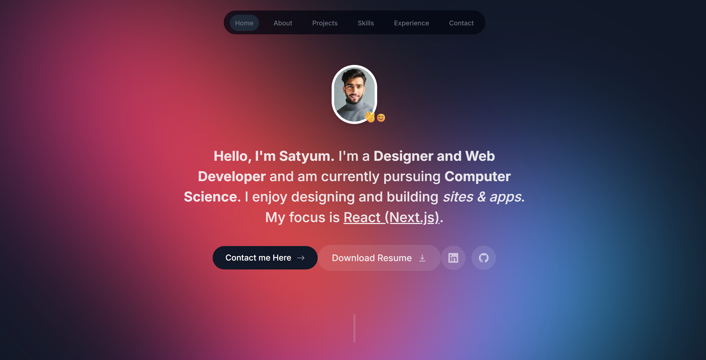
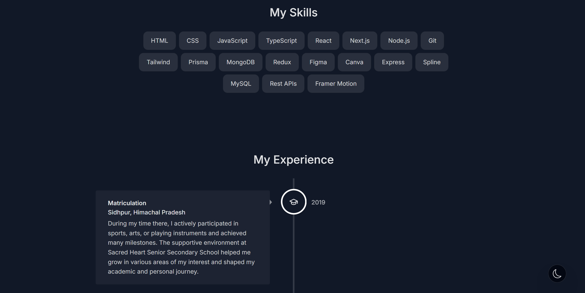
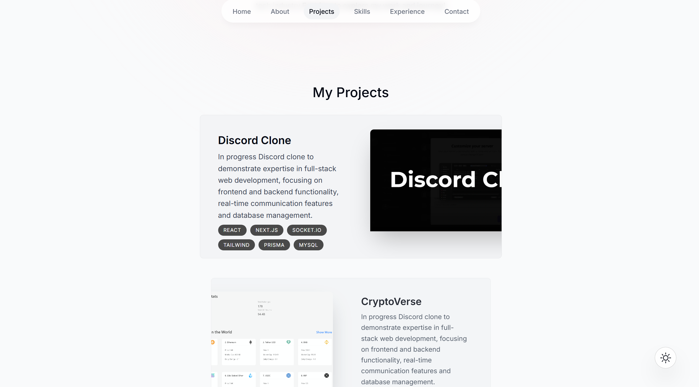

# 🧑‍💻 My Portfolio

Welcome to my personal portfolio website!  
This project showcases my skills, projects, and experience as a full-stack developer and creative designer.

## 🌐 Live Demo

🚀 [View Live Site](https://satyumspathania-portfolio.vercel.app/)

## 📸 Preview

## ✨ Features

- Clean, modern UI with responsive design
- Smooth scroll and interactive animations
- Project showcase with live links and GitHub repos
- Contact form integration
- Dark/light theme toggle (if applicable)

## 🛠️ Built With

- **Frontend**: React.js / Next.js / HTML5 / CSS3 / Tailwind CSS / Sass  
- **Animations**: Framer Motion  
- **Forms**:  EmailJS / Twillio
- **Deployment**: Vercel 

## 🧠 What I Learned

Creating this portfolio helped me:

- Practice responsive UI design
- Implement modern frontend libraries and best practices
- Improve performance optimization and accessibility
- Understand deployment pipelines

## 💡 Future Improvements

- Add blog section
- CMS integration for dynamic content
- Multilingual support

## 📬 Contact

Have a project in mind or want to collaborate?

- 📧 Email: [satyumspathania@gmail.com](mailto:satyumspathania@gmail.com)  
- 🌐 LinkedIn: [linkedin.com/in/Satyum Singh Pathania](https://www.linkedin.com/in/satyum-singh-pathania/)  

## ⭐️ Support

If you like this project, consider giving it a ⭐️ on GitHub!
---

